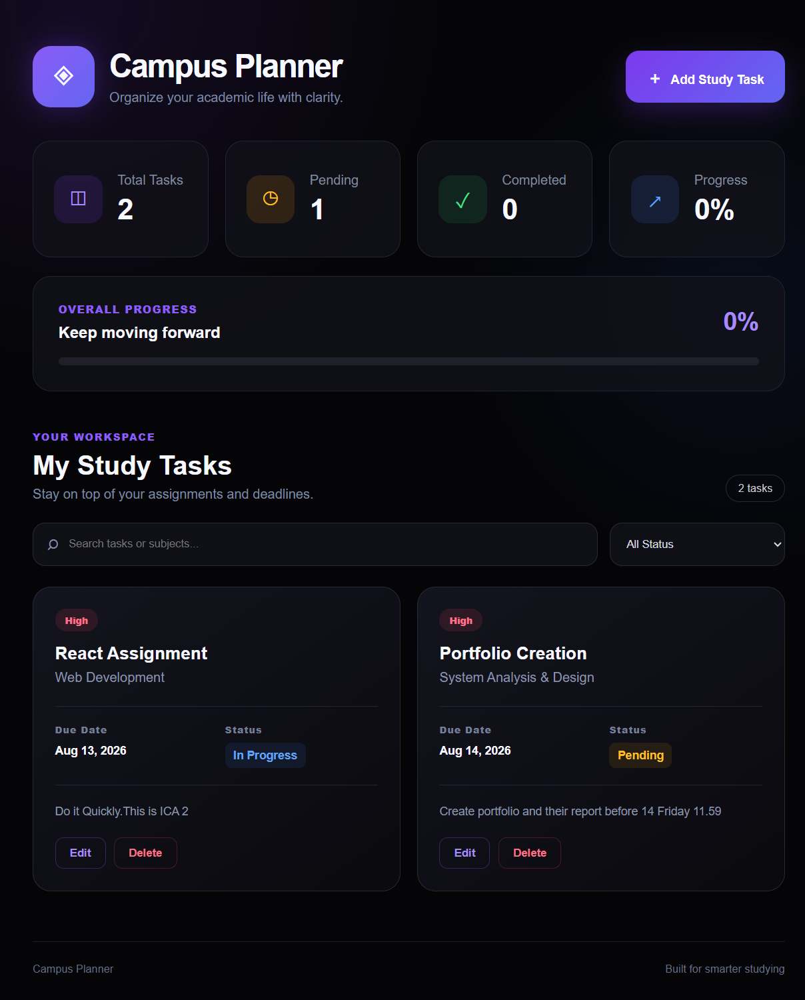
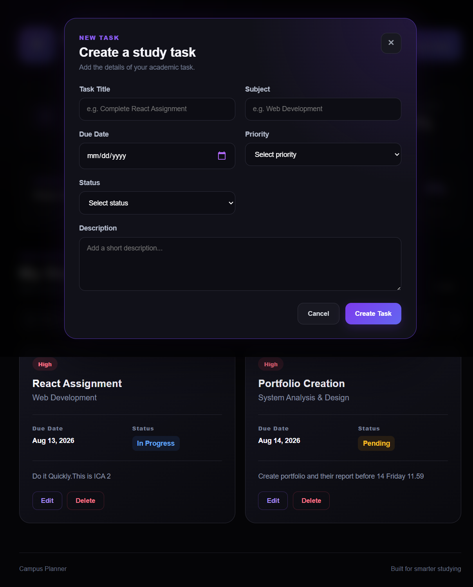

# 🎓 Campus Study Planner

A modern full-stack study task management application designed for university students to organize assignments, study tasks, deadlines, priorities, and academic progress in one place.

Campus Study Planner provides a clean and professional dashboard where students can create, update, delete, search, and filter their study tasks while keeping their data permanently stored in MongoDB.

---

## ✨ Features

### 📚 Study Task Management

- ➕ Create new study tasks
- ✏️ Edit existing study tasks
- 🗑️ Delete study tasks
- 📋 View all study tasks
- 💾 Permanently store tasks in MongoDB

### 📅 Task Information

Each task contains:

- Task title
- Subject
- Due date
- Priority
- Status
- Description

### 🎯 Priority Management

Tasks can be organized into three priority levels:

- 🔴 High
- 🟡 Medium
- 🟢 Low

### 📌 Status Management

Tasks can have three different statuses:

- Pending
- In Progress
- Completed

### 🔎 Search & Filter

- Search tasks by title
- Search tasks by subject
- Filter tasks by status
- View all tasks

### 📊 Progress Dashboard

The dashboard provides:

- Total task count
- Pending task count
- Completed task count
- Overall completion percentage
- Visual progress bar

### 🎨 Modern UI

- Professional dark theme
- Gradient accent colors
- Responsive design
- Modern statistics cards
- Clean task cards
- Search and filter toolbar
- Professional Add Task modal
- Professional Edit Task modal
- Responsive layout

---

# 📸 Screenshots

## Dashboard



## Add Study Task



---

# 🛠️ Tech Stack

## Frontend

- React
- Vite
- JavaScript
- CSS

## Backend

- Node.js
- Express.js
- CORS

## Database

- MongoDB
- Mongoose

## Development Tools

- Visual Studio Code
- Git
- GitHub
- npm

---

# 🏗️ Application Architecture

The application follows a full-stack architecture where the React frontend communicates with the Node.js and Express backend through REST APIs.

```text
┌──────────────────────────────┐
│        React Frontend        │
│                              │
│  Dashboard                   │
│  Task Form                   │
│  Search & Filter             │
│  Task Cards                  │
└──────────────┬───────────────┘
               │
               │ HTTP Requests
               ▼
┌──────────────────────────────┐
│      Node.js + Express       │
│                              │
│       REST API               │
│       CRUD Operations        │
└──────────────┬───────────────┘
               │
               │ Mongoose
               ▼
┌──────────────────────────────┐
│           MongoDB            │
│                              │
│       Study Task Data        │
└──────────────────────────────┘